<div align="center">

# 📊 pretty-charts

**AI Agent 与人类共用的图表风格体系**

数据图与非数据图的完整方法论 · 三档质量标准 · 三套色盲友好主题的机器可读资产

[](https://github.com/whlle-yi/pretty-charts/actions/workflows/ci.yml)
[](LICENSE)
[](#依赖)
[](#安装)
[](#示例)

*English — a charting skill for AI agents: methodology for 40+ chart types, three quality tiers, machine-readable style assets.*

[安装](#安装) · [示例](#示例) · [三档体系](#三档体系) · [文档结构](#文档结构) · [质量保障](#质量保障) · [贡献](#贡献)

</div>

## 这是什么

一个自包含的绘图 Skill。装好后对 Agent 说「画一张论文用的训练流程图」，它按**五步契约**执行：

**定性**（先看数据、过防误导判断）→ **定档**（按输出介质选 T1/T2/T3，产出 chart-plan 决定记录）→ **作图**（按图型与工具规范、加载对应资产）→ **目检**（渲染成图逐项检查）→ **交付**（逐项过清单）。

人类不用 Agent 也能直接取用风格资产与示例代码（见下）。

| 能力 | 说明 |
|---|---|
| 三档质量标准 | T1 出版级 / T2 报告级 / T3 展示级，按**输出介质**判定，不是"学术 vs 商务" |
| 三套色盲友好主题 | Okabe-Ito / Tableau 10 / Paul Tol Vibrant，落成 matplotlib、ECharts、TikZ 资产，取色单一来源 |
| 图型方法论 | 数据图 7 族 40+ 图型（含 Q-Q、平行坐标、桑基、UpSet 等进阶类型）+ 非数据图 5 类 |
| 防误导红线 | 九条硬规则；图注中的 n、置信区间、p 值必须由脚本真实计算，不得编造 |
| 决定记录 | 每次交付写 chart-plan.md：选型、档位、语义→颜色映射一次分配全局复用，防遗忘、防跳步、防漂移 |
| 可机器校验 | 八项自检脚本（引用 / 死链 / 孤儿 / 硬编码颜色 / 产出）+ GitHub Actions CI 三作业 |

## 安装

```bash
git clone https://github.com/whlle-yi/pretty-charts.git

# ZCode
cp -r pretty-charts/skills/pretty-charts ~/.zcode/skills/

# Claude Code（目录结构相同）
cp -r pretty-charts/skills/pretty-charts ~/.claude/skills/
```

Skill 本体无运行时依赖，拷走即用。装好后直接对 Agent 说话即可，例如：

> 画一张论文用的训练流程图
> 这张季度销售数据该怎么展示？给我三种方案

## 只用风格资产

| 工具 | 用法 |
|---|---|
| matplotlib | `plt.style.use("<技能根>/references/assets/matplotlib/academic.mplstyle")`（academic / business / showcase 三选一） |
| ECharts | `echarts.registerTheme("pc", theme)` —— 主题 JSON 见 [references/assets/echarts/](skills/pretty-charts/references/assets/echarts/) |
| TikZ | `\input{.../preamble.tex}` + 模式宏 `\pcPaperMode` / `\pcPPTMode`，详见 [references/tools/tex.md](skills/pretty-charts/references/tools/tex.md) |
| 色板（任意工具） | [references/assets/palettes/](skills/pretty-charts/references/assets/palettes/) 三份 JSON：`categorical` / `sequential` / `diverging` / `neutral` / `missing` / `semantic` 等 token |

## 示例

每个示例都是可运行脚本，成图由仓库内代码实际渲染并提交；脚本 ↔ 成图 ↔ 方法论的完整对照见 [examples/INDEX.md](skills/pretty-charts/examples/INDEX.md)。

### 数据图（7 族代表）

| | | |
|:---:|:---:|:---:|
| **[比较](skills/pretty-charts/references/charts/compare.md)** | **[分布](skills/pretty-charts/references/charts/distribution.md)** | **[构成](skills/pretty-charts/references/charts/compare.md)** |
| 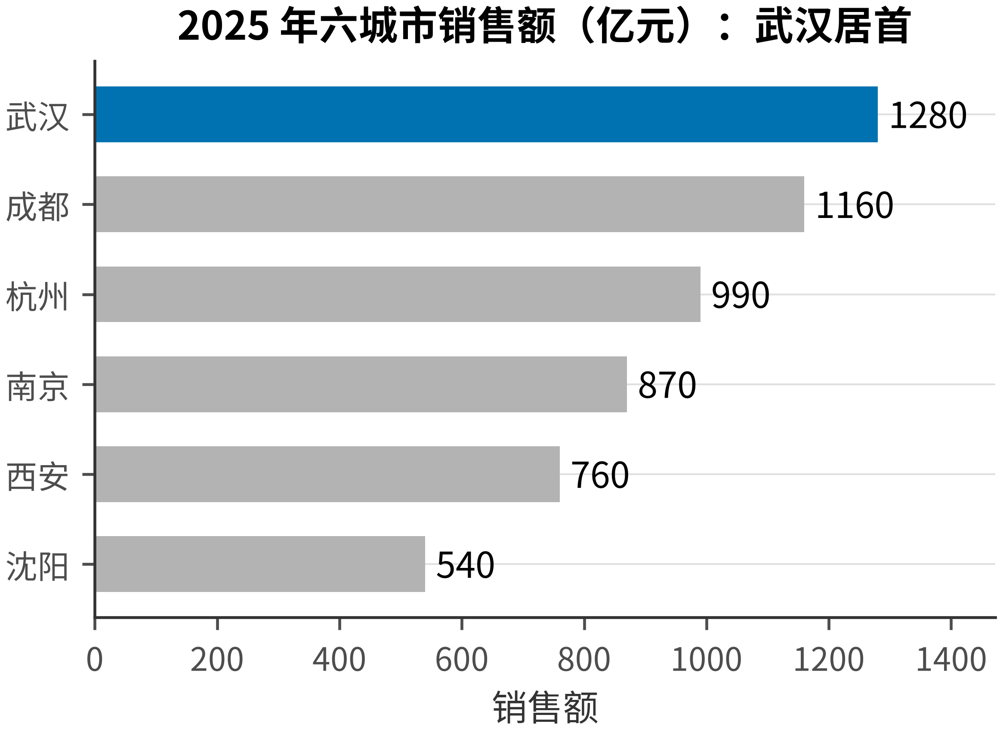 | 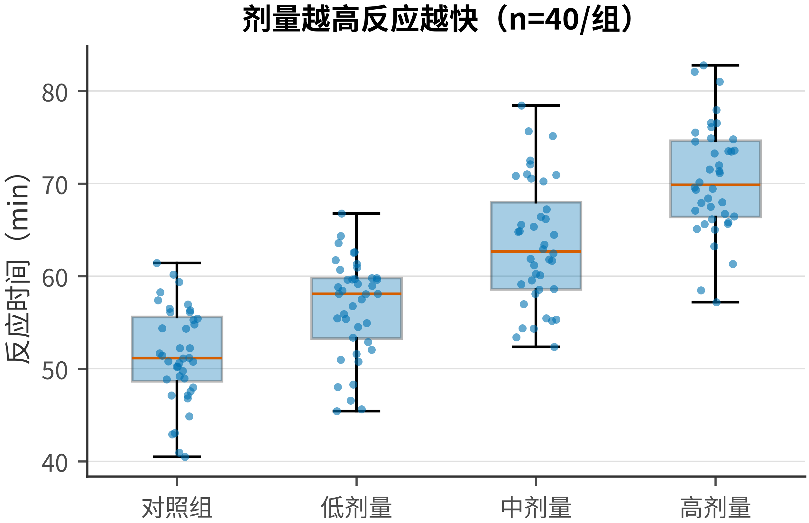 | 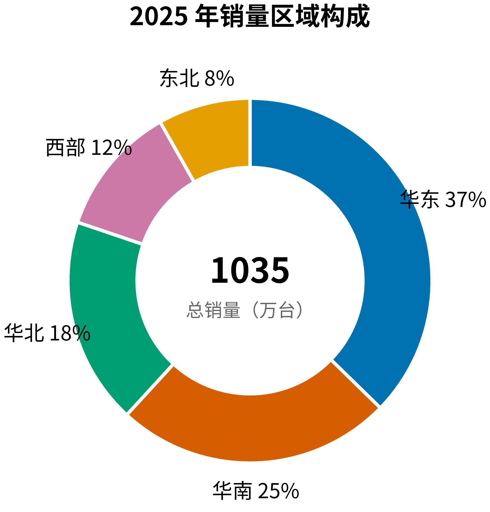 |
| **[趋势](skills/pretty-charts/references/charts/trend.md)** | **[关系](skills/pretty-charts/references/charts/relationship.md)** | **[结构](skills/pretty-charts/references/charts/structure.md)** |
| 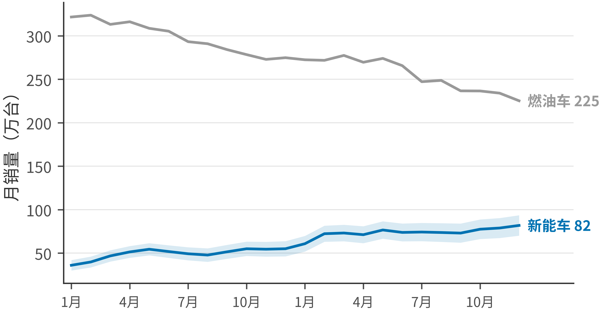 | 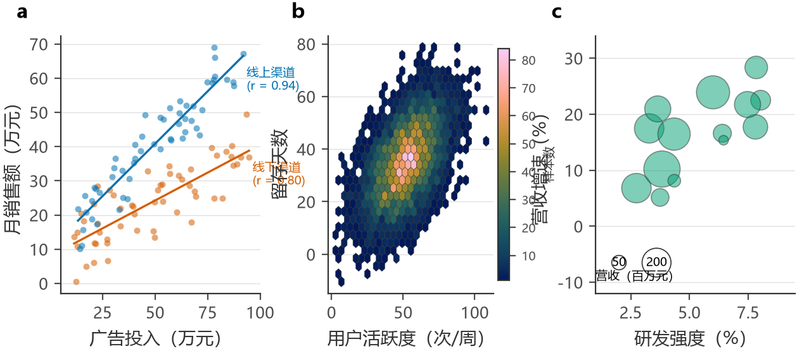 | 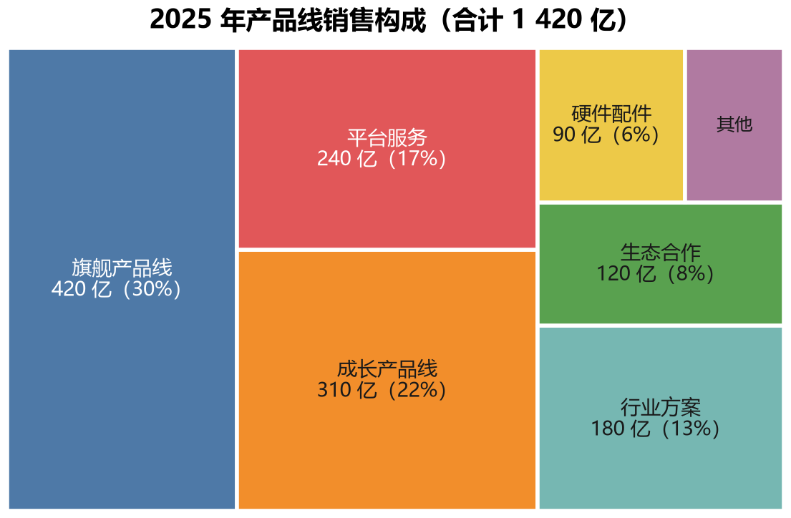 |
| **[地理](skills/pretty-charts/references/charts/map.md)** | **[热图矩阵](skills/pretty-charts/references/charts/relationship.md)** | **[统计推断](skills/pretty-charts/references/charts/inference.md)** |
| 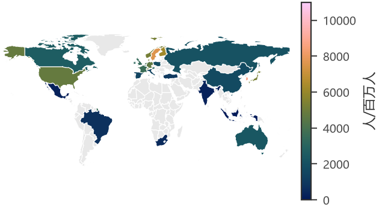 | 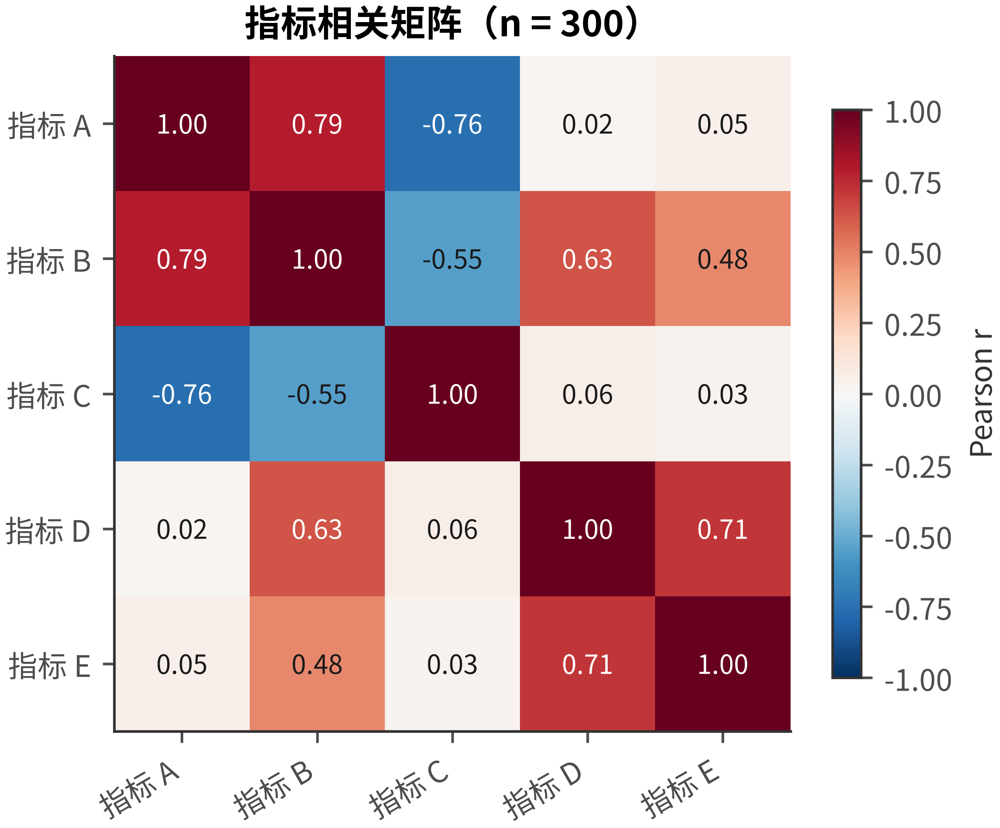 | 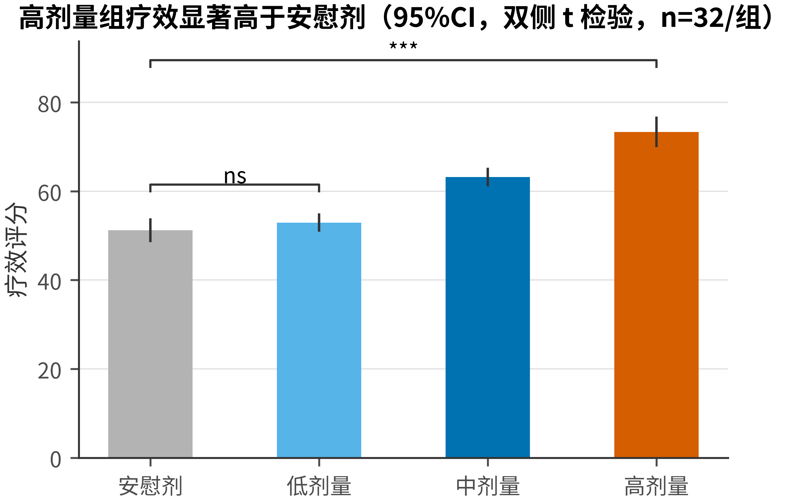 |

### 非数据图（5 类）

| | |
|:---:|:---:|
| **[流程与时序](skills/pretty-charts/references/diagrams.md)** | **[系统架构](skills/pretty-charts/references/diagrams.md)** |
| 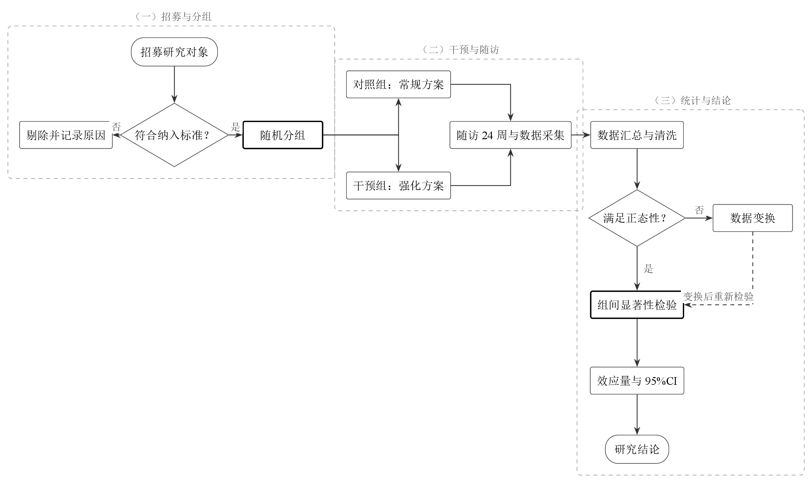 | 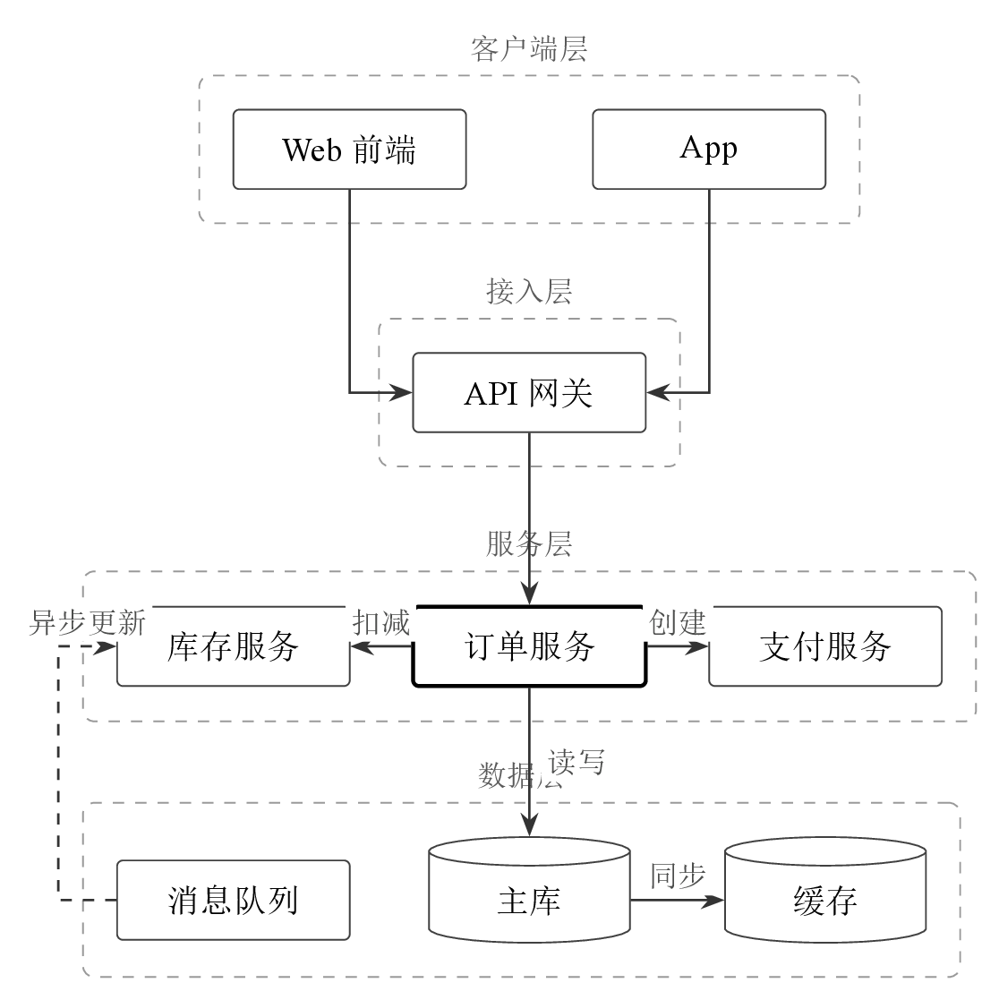 |
| **[层级与逻辑](skills/pretty-charts/references/diagrams.md)** | **[科研示意图](skills/pretty-charts/references/diagrams.md)** |
| 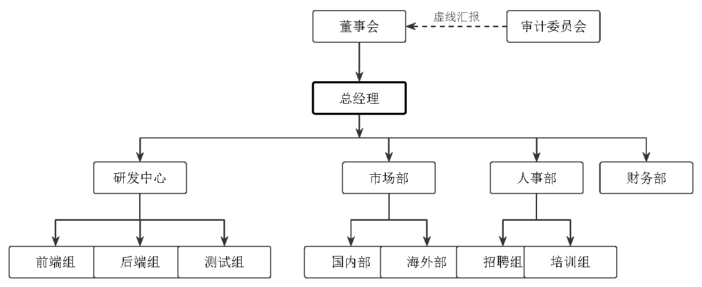 | 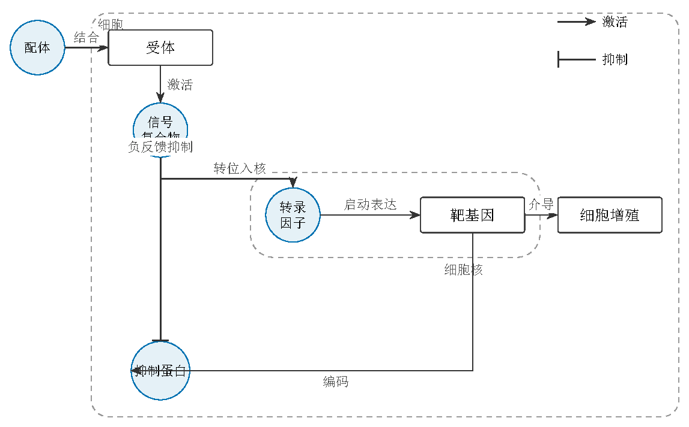 |
| **[信息图](skills/pretty-charts/references/diagrams.md)** | |
| 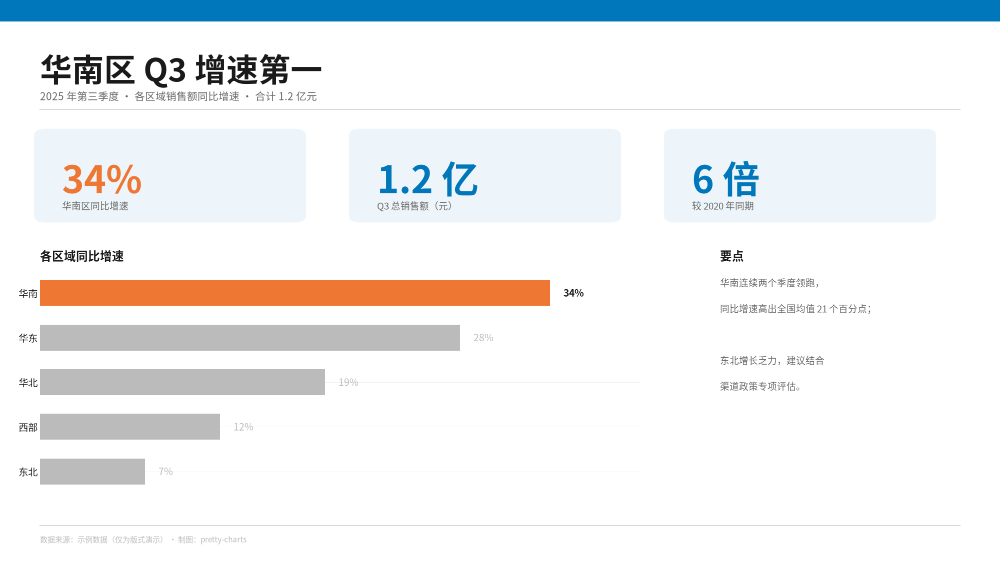 | |

### 三档观感对照

同一份数据在三个档位下的渲染差异，由 [demo_styles.py](skills/pretty-charts/examples/style-demo/demo_styles.py) 生成——它兼作主题 ↔ 色板一致性的断言：

| academic（T1 出版级） | business（T2 报告级） | showcase（T3 展示级） |
|:---:|:---:|:---:|
| 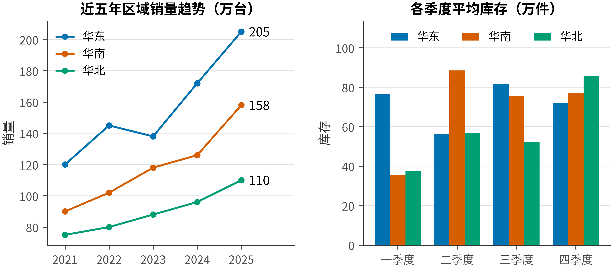 | 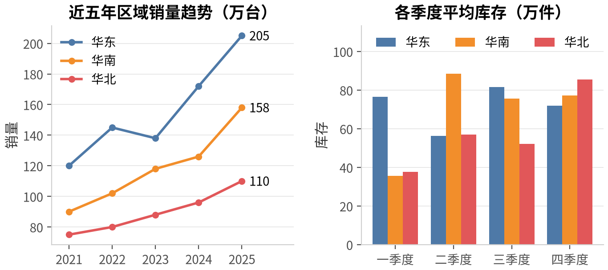 | 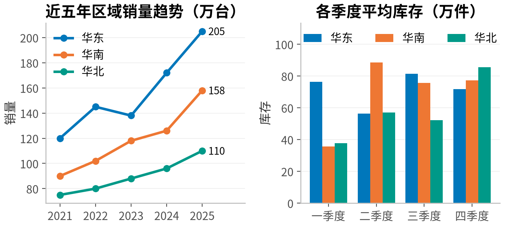 |

论文内嵌效果：[科研流程图](skills/pretty-charts/examples/diagram/flowchart/research_flow.pdf) · [数据图内嵌](skills/pretty-charts/examples/data/paper/paper_embedded_data.pdf) · [地理图内嵌](skills/pretty-charts/examples/data/geo/paper_embedded_geo.pdf) · [层级图内嵌](skills/pretty-charts/examples/diagram/hierarchy/paper_embedded_hierarchy.pdf)

## 文档结构

```tree
pretty-charts/
├── README.md / LICENSE / requirements.txt / requirements-lock.txt
├── .github/workflows/ci.yml    # CI：八项自检 · Python 示例（从锁安装） · LaTeX 编译
├── scripts/check_refs.py       # 八项自检 + 生成示例索引（仓库维护工具，不属于 skill 本体）
└── skills/pretty-charts/       # Skill 本体：自包含，拷走即用
    ├── SKILL.md                # 唯一入口：五步契约 + 两张路由表
    ├── references/
    │   ├── common.md           # 公共规则唯一定义处：红线 / 取色 / 字体 / 尺寸落盘
    │   ├── select.md           # 选型（图型未定时读）
    │   ├── charts/  ×7         # 数据图方法论
    │   ├── diagrams.md         # 非数据图 5 类 + 通用布局
    │   ├── tools/   ×3         # python / web / tex
    │   └── assets/             # 机器可读资产：palettes / matplotlib / echarts / tikz
    └── examples/               # 16 个 Python 脚本 + 16 个 LaTeX 源 + 成图
```

Agent 一次任务的标准读取量 **4–5 个文件**：SKILL.md + common.md + 一份图型方法论 + 一份工具文件。

## 三档体系

| 档位 | 介质 | 主题 | 关键约束 |
|---|---|---|---|
| T1 出版级 | 印刷（期刊 / 学位论文） | academic | 灰度打印可辨、误差与显著性规范、矢量导出、精确栏宽 |
| T2 报告级 | 屏幕文档 | business | 标题即结论、关键数值直标 |
| T3 展示级 | 投影 / 远距离 | showcase | 一图一结论、最后一排可读 |

完整判定表见 [SKILL.md](skills/pretty-charts/SKILL.md) 第 2 步；各档差异参数在 [common.md](skills/pretty-charts/references/common.md) 各表与资产文件内。

## 质量保障

| 检查 | 结果 |
|---|---|
| Python 示例 | 16/16 exit 0（CI 从 requirements-lock.txt 安装） |
| LaTeX 示例 | 16/16 xelatex 编译通过（含 Windows 原生字体 → Noto CJK → Fandol 跨平台回退） |
| 八项自检 `scripts/check_refs.py` | 引用完整 · 无死链 · 无孤儿方法论 / 示例 · 无硬编码颜色 · 产出齐备 |
| 主题 ↔ 色板一致性 | demo_styles.py 逐色断言等于 palettes/*.json |
| CI | 三作业：结构与引用自检 · Python 示例 · LaTeX 编译 |

**已知限制**：TikZ 只有论文 / 演示两种模式（business 模式待做）；CI 不做成图字节比对（字体光栅化与 PDF 时间戳跨平台必然不同）；PDF→PNG 的 Ghostscript 管线未本机实测。

## 依赖

| 文件 | 角色 |
|---|---|
| [requirements.txt](requirements.txt) | 版本区间（人读） |
| [requirements-lock.txt](requirements-lock.txt) | 精确锁（uv 编译），CI 从此安装 |

改区间后重编译：`uv pip compile requirements.txt --universal --python-version 3.12 -o requirements-lock.txt`

## 贡献

提交前 `python scripts/check_refs.py` 退出码 0（八项校验，CI 复跑；孤儿示例、索引过期、硬编码颜色都会被自动拦下），动了示例就重跑 `--write-index`。其余规范不写在本页：由 [SKILL.md](skills/pretty-charts/SKILL.md) 与 [common.md](skills/pretty-charts/references/common.md) 在流程中强制。

提交信息用 `类型: 摘要`。

## 路线图

- [x] 风格基建：三套色盲友好主题 + matplotlib / ECharts / TikZ 资产
- [x] 数据图方法论 + 画廊：7 族全部有代表成图；非数据图 5 类全 TikZ 化
- [x] 五步契约 + chart-plan 决定记录 + 渲染目检回路
- [x] 文档重构：公共规则单一来源（common.md）+ 唯一路由 + 生成式示例索引
- [x] 依赖锁定：版本区间 + uv 编译的锁文件，CI 从锁安装
- [x] CI：三作业（自检 / Python / LaTeX）+ LaTeX 字体跨平台回退
- [ ] TikZ business / showcase 模式
- [ ] 插件清单（`.zcode-plugin/` / `.claude-plugin/`），安装一条命令
- [ ] 数据图第二批画廊：桑基、山脊图、ECDF、日历热图，及 Q-Q、平行坐标、散点矩阵、凹凸图、UpSet、漏斗
- [ ] 双语 README（英文全量版）

## 致谢

配色基于 [Okabe-Ito](https://jfly.uni-koeln.de/color/)、[Tableau 10](https://www.tableau.com/) 与 [Paul Tol](https://personal.sron.nl/~pault/) 色板，顺序 / 发散色图取自 [ColorBrewer](https://colorbrewer2.org/) 与 [Crameri Scientific Colour Maps](https://www.fabiocrameri.ch/colourmaps/)（使用需引用 Crameri, Shephard & Heron, 2020, *Nature Communications*）；非数据图渲染依赖 [TikZ/pgfplots](https://ctan.org/pkg/pgfplots)、[pgfgantt](https://ctan.org/pkg/pgfgantt)；底图数据来自 [Natural Earth](https://www.naturalearthdata.com/)（公有领域）；期刊适配依赖 [SciencePlots](https://github.com/garrettj403/SciencePlots)。

## 许可

[MIT](LICENSE) © 2026 [whlle-yi](https://github.com/whlle-yi)
