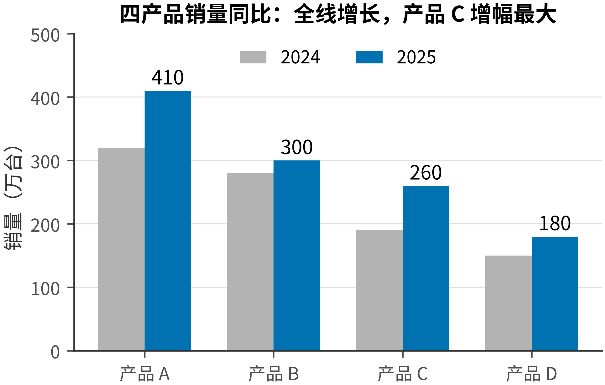
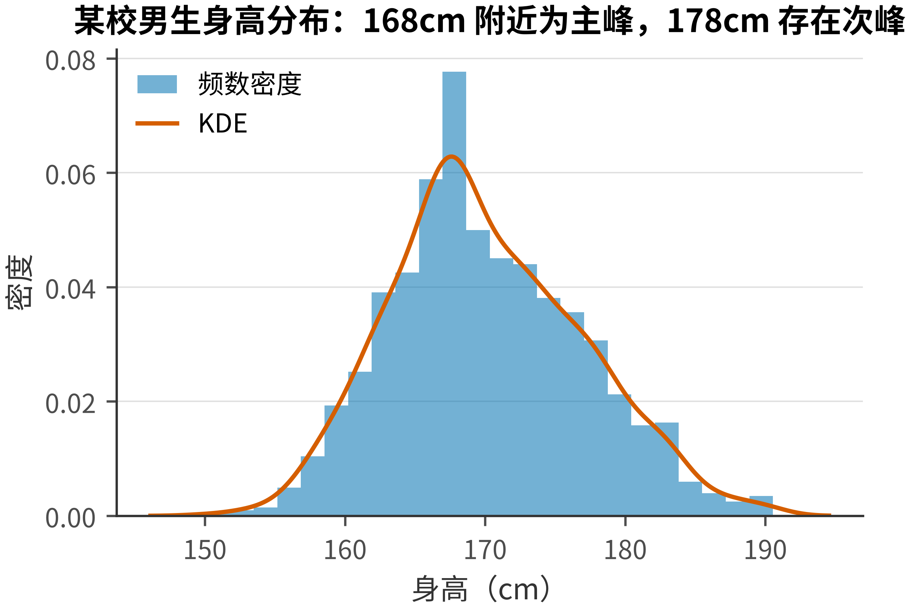
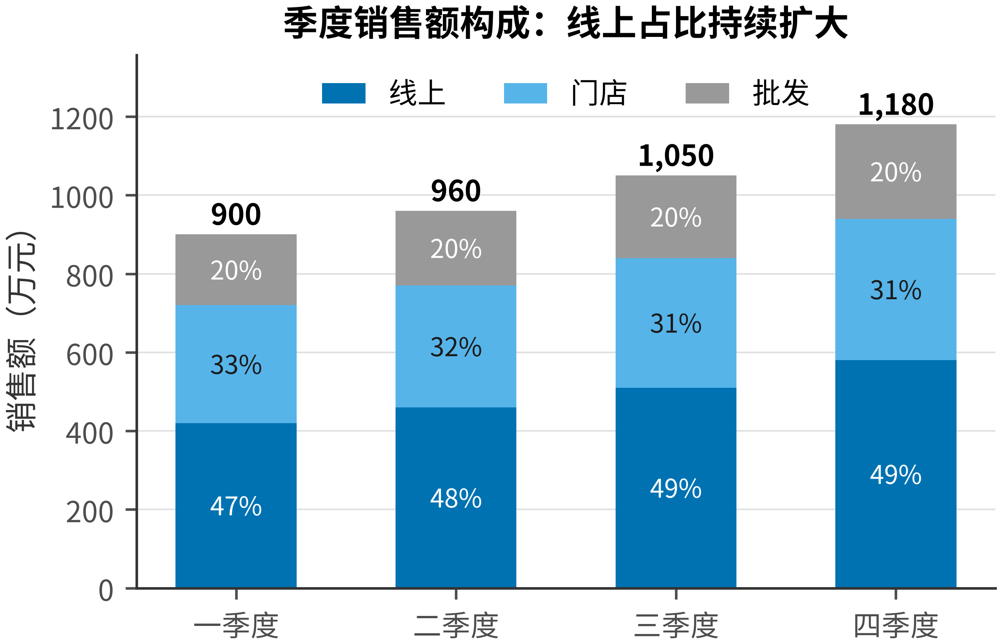
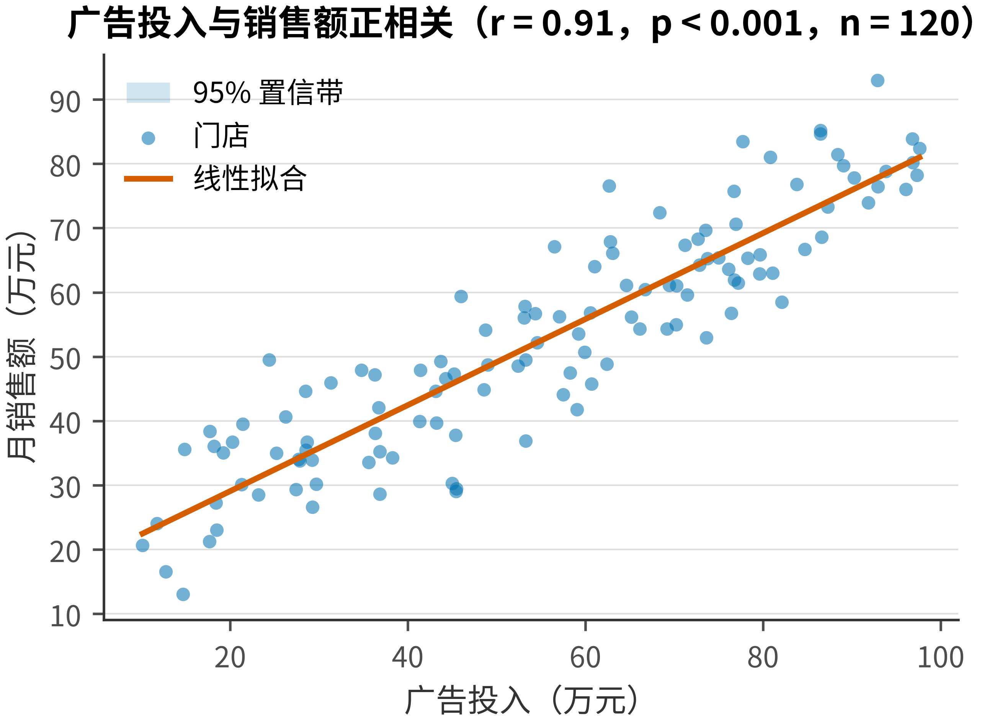
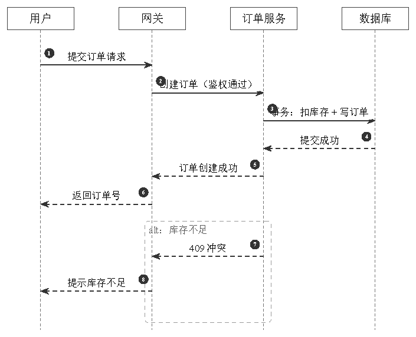
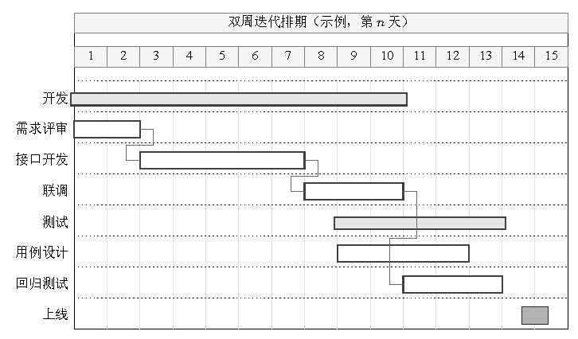
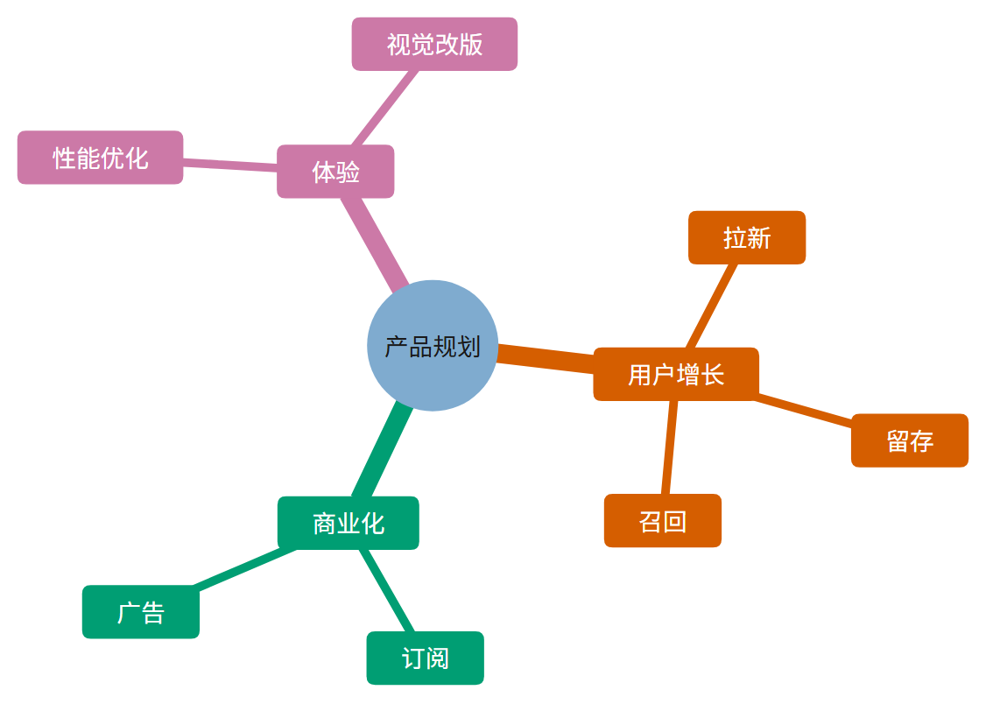
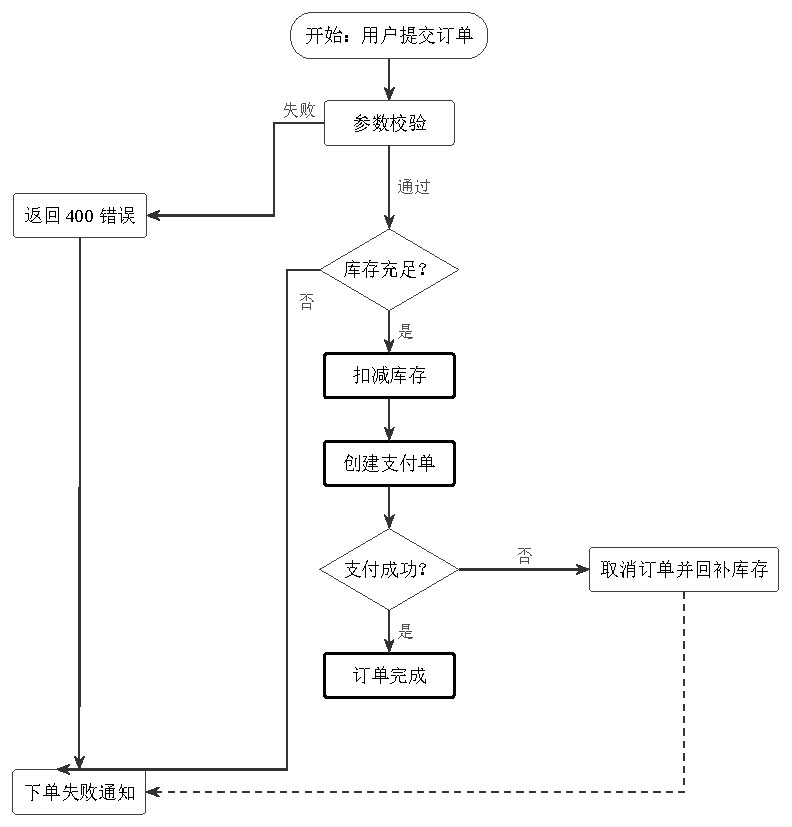
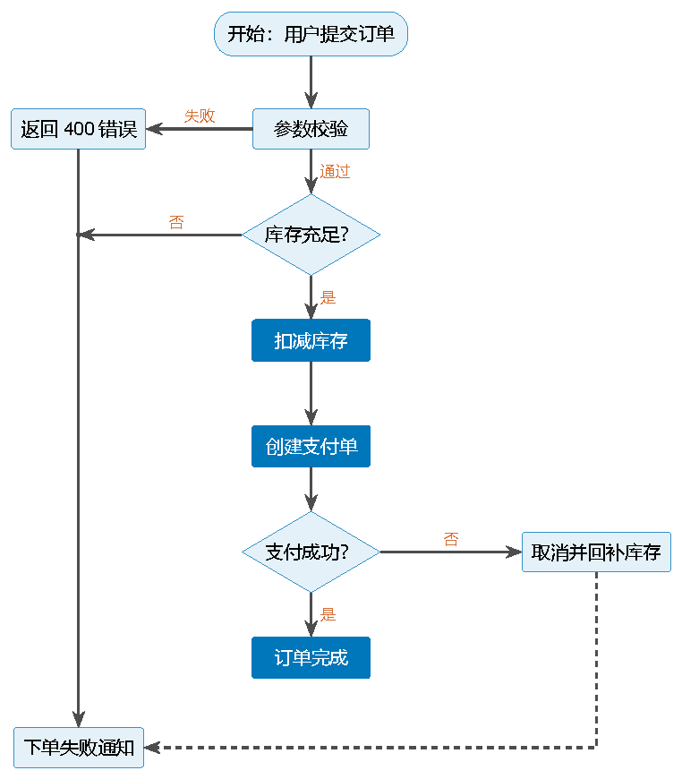

<div align="center">

# 📊 pretty-charts

**高质量绘图技能库 —— AI Agent 与人类共用的统一图表风格体系**

[](LICENSE)
[](#快速开始)
[](#示例)
[](#路线图)

[快速开始](#快速开始) · [示例](#示例) · [文档](#文档)

</div>

---

为 AI Agent（ZCode / Claude Code 等 skills 机制）提供图表绘制全流程指导，同时提供可直接复用的跨工具栈风格资产。覆盖数据图与非数据图，出版 / 报告 / 演示三档质量标准，方法论按需加载，全部示例附可运行代码与成图。

## 示例

全部成图由仓库内代码实际渲染，见 [examples/](skills/pretty-charts/examples/)。

| 排序条形 | 分组柱状 | 直方图+KDE | 箱线+散点 |
|:---:|:---:|:---:|:---:|
|  |  |  |  |

| 堆叠柱 | 环图 | 折线 | 散点+置信带 |
|:---:|:---:|:---:|:---:|
|  |  |  |  |

| 相关矩阵 | 均值+95%CI |
|:---:|:---:|
|  |  |

| 时序图 | 甘特图 | 思维导图 | 三层架构图 |
|:---:|:---:|:---:|:---:|
|  |  |  |  |

| TikZ 流程图·论文版 | TikZ 流程图·演示版 |
|:---:|:---:|
|  |  |

论文内嵌效果：[简单版](skills/pretty-charts/examples/diagram/flowchart/paper_embedded.pdf) · [复杂版（阶段分组/回流）](skills/pretty-charts/examples/diagram/flowchart/paper_embedded_complex.pdf) · [管线示意图](skills/pretty-charts/examples/diagram/schematic/pipeline_schematic.pdf)

## 快速开始

**安装为 AI Skill**

```bash
git clone https://github.com/whlle-yi/pretty-charts.git
cp -r pretty-charts/skills/pretty-charts ~/.zcode/skills/
```

对 Agent 说"画一张论文用的训练流程图"，自动执行：定性 → 定档 → 按场景清单加载方法论 → 按主题作图 → 按清单自查交付。

**直接使用风格资产**

| 工具 | 用法 |
|---|---|
| matplotlib | `plt.style.use("references/style/matplotlib/academic.mplstyle")` |
| ECharts | `echarts.registerTheme("pc", theme)` —— 主题 JSON 见 [references/style/echarts/](skills/pretty-charts/references/style/echarts/) |
| TikZ | `\input{references/style/tikz/preamble.tex}` + `\input{references/style/tikz/flowchart-styles.tex}` |

## 质量分档

| 档位 | 场景 | 主题（色板来源） | 关键约束 |
|:---:|---|:---:|---|
| T1 出版级 | 期刊 / 学位论文 | academic（Okabe-Ito） | 流程图无底色、黑白可辨、误差与显著性规范、矢量导出 |
| T2 报告级 | 咨询 / 商务文档 | business（Tableau 10） | 标题即结论、关键数值直标、语义色可用 |
| T3 展示级 | PPT / 海报 / 大屏 | showcase（Tol Vibrant） | 一图一结论、系列 ≤3、远距离可读 |

档位是场景标准而非质量排名，质量以各档[自查清单](skills/pretty-charts/references/style-guide.md)衡量。

## 文件地图

| 时机 | 文件 |
|---|---|
| ① 被代码加载，不读 | `references/style/matplotlib/*.mplstyle` · `references/style/echarts/*.json` · `references/style/tikz/*.tex` |
| ② AI 每次任务必读 | `SKILL.md`（定性 + 定档） |
| ③ 定档后读一次 | [`references/scenarios.md`](skills/pretty-charts/references/scenarios.md)（对应档位一节） |
| ④ 画什么读什么 | `references/data/`（9 类分析目的 + 选型）· `references/diagram/`（5 类图型 + 选型） |
| ⑤ 按工具栈读 | `data/tool-{matplotlib,echarts}.md` · `diagram/tool-{tikz,graphviz,svg}.md` |
| ⑥ 交付前查 | `references/style-guide.md` §7 对应清单 · `references/style/fonts.md` |
| ⑦ 参照模仿 | `examples/`（代码 + 成图） |

## 仓库结构

```
pretty-charts/
├── README.md / LICENSE / .gitignore
└── skills/
    └── pretty-charts/          # skill 本体：自包含，拷走即用
        ├── SKILL.md            # 入口：定性路由 + 执行顺序契约
        ├── references/
        │   ├── scenarios.md    # 三档场景入口（阅读路径 + 专属规则）
        │   ├── style-guide.md  # 风格总纲（配色/字体/导出/防误导/清单）
        │   ├── data/           # 数据图：选型 + 9 类目的 + 2 工具栈
        │   └── diagram/        # 非数据图：5 类图型 + 4 工具栈
        │   └── style/          # 风格资产：palettes / matplotlib / echarts / tikz / fonts
        ├── examples/           # 示例画廊：代码 + 成图
```

## 文档

| 文档 | 内容 |
|---|---|
| [SKILL.md](skills/pretty-charts/SKILL.md) | 入口：定性 → 定档 → 执行顺序契约 |
| [content-analysis.md](skills/pretty-charts/references/content-analysis.md) | 只有一段内容不知画什么图？从这里开始 |
| [scenarios.md](skills/pretty-charts/references/scenarios.md) | 三档场景：阅读顺序与专属规则 |
| [style-guide.md](skills/pretty-charts/references/style-guide.md) | 配色 / 字体 / 导出 / 防误导红线 / 三档清单 |
| [chart-selection.md](skills/pretty-charts/references/data/chart-selection.md) | 数据图选型决策树 |
| [diagram-selection.md](skills/pretty-charts/references/diagram/diagram-selection.md) | 非数据图选型决策树 |
| [fonts.md](skills/pretty-charts/references/style/fonts.md) | 字体方案与回退链 |

## 路线图

- [x] 风格基建（三套色盲友好主题 × 4 工具栈）
- [x] 数据图方法论 + 首批画廊（10 图型）
- [x] 非数据图方法论 + 首批画廊（TikZ 7 例：流程双版/时序/甘特/思维导/架构/管线示意）
- [ ] 数据图第二批画廊：树图、桑基、山脊图、ECDF、哑铃图
- [ ] 地理可视化示例（choropleth / 比例符号地图）
- [ ] 信息图整页版式示例
- [ ] CI 自动渲染示例图
- [ ] 双语 README

## 致谢

配色基于 [Okabe-Ito](https://jfly.uni-koeln.de/color/)、[Tableau 10](https://www.tableau.com/) 与 [Paul Tol](https://personal.sron.nl/~pault/) 色板；非数据图渲染依赖 [TikZ/pgfplots](https://ctan.org/pkg/pgfplots) 与 [pgfgantt](https://ctan.org/pkg/pgfgantt)。

## 许可

[MIT](LICENSE) © 2026 [whlle-yi](https://github.com/whlle-yi)
