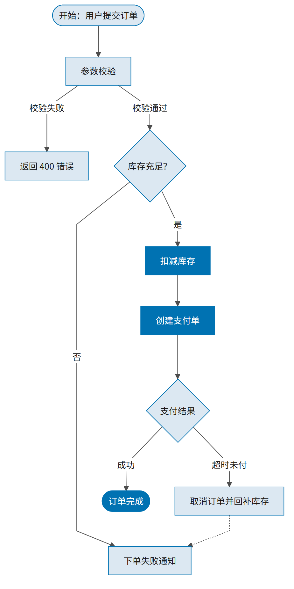

<div align="center">

# 📊 pretty-charts

**让 AI 与人类都能画出"出版级"图表的技能库**

统一风格体系 · 数据图 + 非数据图方法论 · 三档质量标准 · 代码与成图齐全的示例画廊

[](LICENSE)
[](#-快速开始)
[](#-示例画廊)
[](#-路线图)

**[快速开始](#-快速开始) · [示例画廊](#-示例画廊) · [文档导航](#-文档导航) · [路线图](#-路线图)**

</div>

---

## 这是什么

pretty-charts 是一个给 AI Agent（ZCode / Claude Code 等 skills 机制）用的**高质量绘图技能**，同时提供一套人类可以直接复用的**图表风格资产**。

它解决三个真实痛点：

| 痛点 | pretty-charts 的答案 |
|---|---|
| AI 画图风格随机、每次不一样 | 一套**主题资产**（色板/mplstyle/ECharts/mermaid/TikZ）作为唯一取色与样式来源 |
| 图型选错、图表误导（截断轴、滥用双轴、彩虹热图） | 按**分析目的**组织的选型决策树 + 9 条防误导红线 |
| 学术投稿、商务汇报、PPT 展示要求不同 | **三档质量标准**（出版级/报告级/展示级），各带可执行自查清单 |

## 示例画廊

全部示例由仓库内代码实际渲染，代码与成图一一对应，见 [`skills/pretty-charts/examples/`](skills/pretty-charts/examples/)。

### 数据图（matplotlib，学术主题）

| 排序条形 + 灰化强调 | 分组柱状 + 图例置顶 | 直方图 + KDE | 箱线 + 抖动散点 |
|:---:|:---:|:---:|:---:|
|  |  |  |  |

| 堆叠柱 + 占比标注 | 环图 + 中心总量 | 折线 + 线端直标 | 散点 + 置信带 |
|:---:|:---:|:---:|:---:|
|  |  |  |  |

| 相关矩阵热图 | 均值 + 95%CI + 显著性 |
|:---:|:---:|
|  |  |

### 非数据图（mermaid 主题）

| 订单流程图（mermaid 草稿版） | API 时序图 | 迭代甘特图 | 思维导图 | 三层架构图 |
|:---:|:---:|:---:|:---:|:---:|
|  |  |  |  |  |

| TikZ 流程图·论文版（无底色，宋体+TNR） | TikZ 流程图·演示版（彩色，黑体+Arial） |
|:---:|:---:|
|  |  |

同一结构两套模式，只差样式开关与字体两行——另有 [科研管线示意图（PDF 矢量）](skills/pretty-charts/examples/diagram/schematic/pipeline_schematic.pdf)。

## 🚀 快速开始

### 方式一：安装为 AI Skill（推荐）

把 [`skills/pretty-charts/`](skills/pretty-charts/) 整个文件夹复制到你的 skills 目录：

```bash
# ZCode / Claude Code（按你的实际配置路径）
git clone https://github.com/whlle-yi/pretty-charts.git
cp -r pretty-charts/skills/pretty-charts ~/.zcode/skills/
```

之后对 Agent 说"画一张各组疗效对比图"，它会自动：**定性**（数据图/非数据图）→ **定档**（出版/报告/展示）→ **加载对应方法论** → **按主题作图** → **按清单自查**。

### 方式二：人类直接复用主题资产

<details open>
<summary><b>matplotlib（学术主题）</b></summary>

```python
import matplotlib.pyplot as plt
plt.style.use("assets/matplotlib/academic.mplstyle")  # business / showcase 可换
```

</details>

<details>
<summary><b>ECharts（主题注册）</b></summary>

```js
const theme = await (await fetch("assets/echarts/business.json")).json();
echarts.registerTheme("pretty-charts", theme);
const chart = echarts.init(dom, "pretty-charts", { renderer: "svg" });
```

</details>

<details>
<summary><b>mermaid（命令行渲染）</b></summary>

```bash
mmdc -i diagram.mmd -o diagram.png -c assets/mermaid/mermaid-config.json -b white -s 2
# 无 chrome-headless-shell 时用系统 Edge：-p examples/diagram/puppeteer-edge.json
```

</details>

<details>
<summary><b>TikZ / XeLaTeX（出版级示意图）</b></summary>

```latex
\documentclass[border=6pt]{standalone}
\input{assets/tikz/preamble.tex}   % 主题配色 pcBlue... + 轴风格
\begin{document}
\begin{tikzpicture} ... \end{tikzpicture}
\end{document}
```

</details>

## 🎚 质量分档

同一套风格体系，三档严格程度；用户未指定时按场景自动选择：

| 档位 | 名称 | 默认主题 | 典型场景 | 关键约束 |
|:---:|---|:---:|---|---|
| T1 | 出版级 | academic | 期刊论文、学位论文 | 字号 ≥7pt、600dpi、误差与显著性规范、图注自含 |
| T2 | 报告级 | business | 咨询/商务报告、文档配图 | 标题即结论、关键数值直标、200dpi |
| T3 | 展示级 | showcase | PPT、海报、社交媒体 | 一图一结论、粗线大字、远距离可读 |

三套色板均通过色盲安全校验：

| 色板 | 来源 | 适用 |
|---|---|---|
| academic | Okabe-Ito | T1 印刷友好 |
| business | Tableau 10 | T2 蓝色锚定 |
| showcase | Paul Tol Vibrant | T3 高对比 |

## 🗂 文件地图：什么时候用哪个

skill 的文件不是让人通读的，而是 AI 按"洋葱式"路径按需加载的。按使用时机分八类：

| 时机 | 文件 | 说明 |
|---|---|---|
| **① 从不被读，被代码加载** | `assets/matplotlib/*.mplstyle`、`assets/echarts/*.json`、`assets/mermaid/*.json`、`assets/tikz/*.tex` | `plt.style.use()` / `registerTheme()` / `mmdc -c` / `\input` 直接消费 |
| **② AI 每次任务必读** | `skills/pretty-charts/SKILL.md` | 入口：定性 + 定档，全程唯一必读文件 |
| **③ 定档后读一次** | `references/scenarios.md` | 只读对应档位一节：阅读清单 + 场景专属规则 |
| **④ 画什么读什么** | `references/data/`（9 个分析目的 + 选型）、`references/diagram/`（5 类图型 + 选型） | 每次只读 1~2 个 |
| **⑤ 按工具栈读** | `data/tool-{matplotlib,echarts}.md`、`diagram/tool-{mermaid,tikz,graphviz,svg}.md` | 技术细节与已知坑 |
| **⑥ 交付前查** | `references/style-guide.md` §7 对应清单（§6 防误导红线随时）、`assets/fonts.md` | 逐项自查 |
| **⑦ 参照模仿** | `examples/`（代码 + 成图） | 作图前找相近示例改 |
| **⑧ 纯给人看** | `README.md`、`LICENSE` | AI 不读 |

一次典型任务的实际读取路径：**② → ③ → ④⑤各 1~2 个 → ⑥**，其余文件全程不碰。完整决策流见 [SKILL.md 的执行顺序契约](skills/pretty-charts/SKILL.md)。

## 📁 仓库结构

```
pretty-charts/
├── README.md / LICENSE / .gitignore
└── skills/
    └── pretty-charts/          # ★ skill 本体：一个自包含单元，拷走即用
        ├── SKILL.md            #   入口：定性路由 + 分档 + 通用规则
        ├── references/
        │   ├── style-guide.md  #   风格总纲（配色/字体/导出/防误导/三档清单）
        │   ├── data/           #   数据图：选型决策树 + 9 类分析目的 + 2 工具栈
        │   └── diagram/        #   非数据图：5 类图型 + 4 工具栈
        ├── assets/             #   palettes / matplotlib / echarts / mermaid / tikz / fonts
        ├── examples/           #   示例画廊：每例 = 可运行代码 + 实际成图
        └── scripts/            #   辅助脚本
```

## 📚 文档导航

| 文档 | 内容 |
|---|---|
| [SKILL.md](skills/pretty-charts/SKILL.md) | 技能入口：定性 → 定档 → 路由的完整决策流 |
| [场景入口](skills/pretty-charts/references/scenarios.md) | 论文/报告/演示三档的精确阅读顺序与场景专属规则 |
| [风格规范总纲](skills/pretty-charts/references/style-guide.md) | 配色规则、字体方案、导出规格、9 条防误导红线、三档自查清单 |
| [数据图选型](skills/pretty-charts/references/data/chart-selection.md) | "读者要回答什么问题"决策树 + 图型速查表 |
| [非数据图选型](skills/pretty-charts/references/diagram/diagram-selection.md) | 流程/架构/层级/示意/信息图路由 + 通用布局规范 |
| [字体方案](skills/pretty-charts/assets/fonts.md) | 中西文搭配、回退链、各档字号层级 |

## 🗺 路线图

- [x] 风格基建（三套色盲友好主题，覆盖 matplotlib / ECharts / mermaid / TikZ）
- [x] 数据图方法论 + 首批画廊（10 图型）
- [x] 非数据图方法论 + 首批画廊（mermaid 5 例 + TikZ 1 例）
- [ ] 数据图第二批画廊：树图、桑基、山脊图、ECDF、哑铃图
- [ ] 地理可视化示例（choropleth / 比例符号地图）
- [ ] 信息图整页版式示例
- [ ] CI 自动渲染示例图（保证画廊与代码永远同步）
- [ ] 双语 README

## ✨ 设计原则

1. **准确 > 易读 > 简洁 > 美观**——任何与高优先级冲突的美化都舍弃。
2. **颜色只从色板取**——三套色板全部色盲友好，禁止临时凑色。
3. **防误导优先于美观**——柱状零起点、不滥用双轴、不确定度不省略。
4. **skill 自包含**——所有运行时资产都在 skill 文件夹内，拷走即用。

## 🙏 致谢

配色体系基于 [Okabe-Ito Color Universal Design](https://jfly.uni-koeln.de/color/)、[Tableau 10](https://www.tableau.com/) 与 [Paul Tol 的配色方案](https://personal.sron.nl/~pault/)；非数据图渲染依赖 [mermaid](https://mermaid.js.org/) 与 [TikZ/pgfplots](https://ctan.org/pkg/pgfplots)。

## 📄 许可

[MIT](LICENSE) © 2026 [whlle-yi](https://github.com/whlle-yi)
